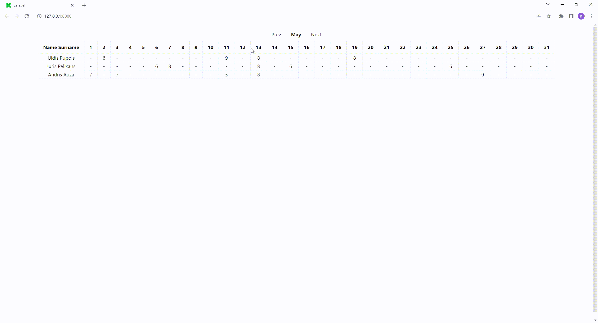

## Vue.js and Laravel, employee working hours table

App where you can store employee working hours. Updates view with entered hour amount and sends data to backend, to store in database.

## How to run
* run command `composer install`
* create database
* create .env file. Copy .env.example data to .env file or use command: `cp .env.example .env`, replace with your mysql data to match your database.
* run command `php artisan migrate` to migrate tables to your database
* run command `php artisan serve` to view in web.
